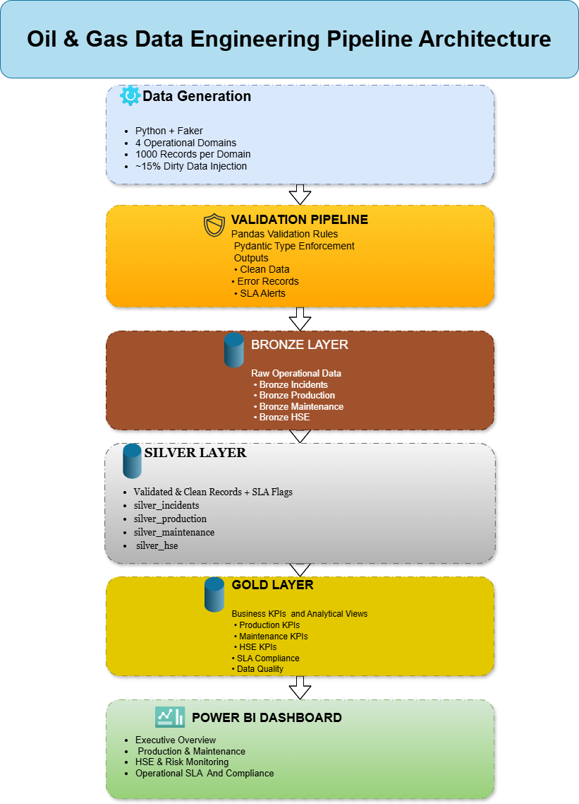
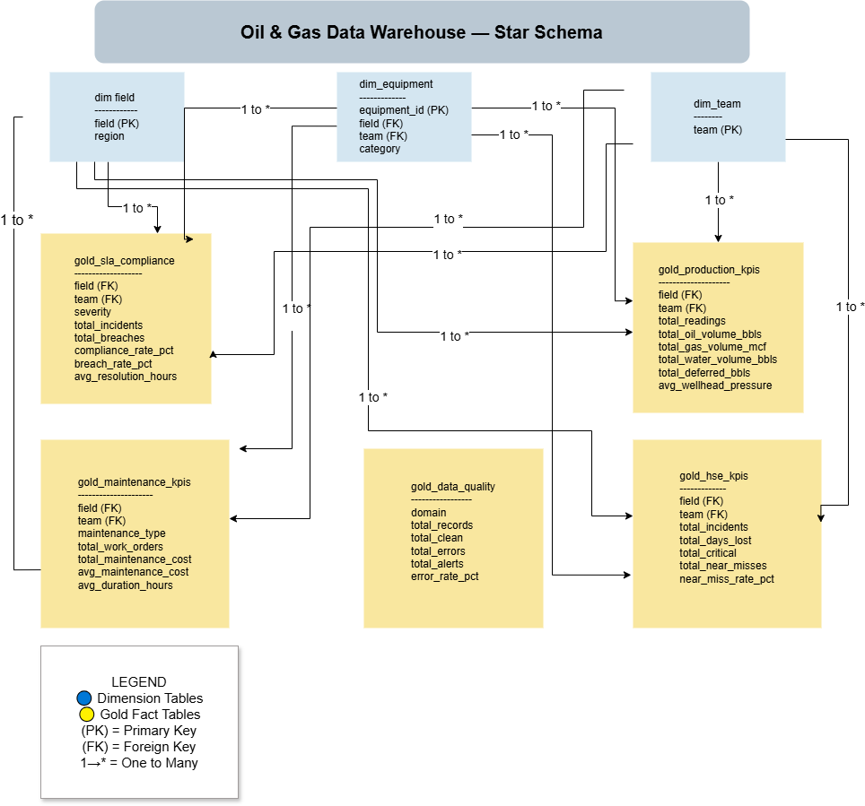
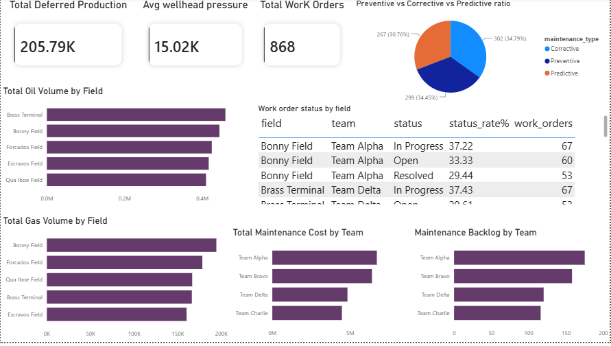
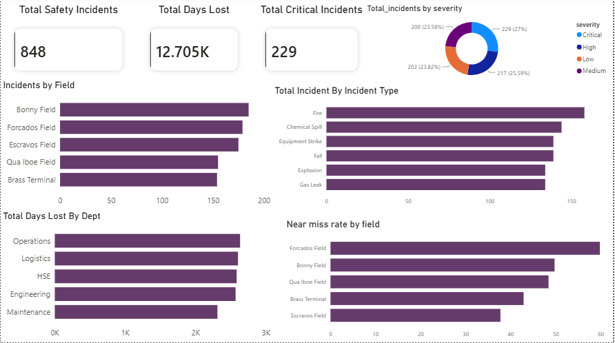
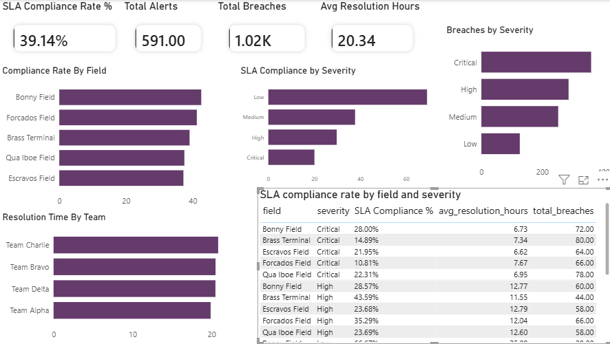

# 🛢️ Oil & Gas Operations Analytics Platform

> An end-to-end data engineering project that simulates a real-world operational analytics platform for an oil & gas company.


---

## 📖 Project Overview

Oil & Gas companies generate operational data every day across multiple business domains including production, maintenance, health & safety, and operational incidents. Without an integrated analytics platform, decision-makers struggle to identify production losses, maintenance backlogs, safety risks, and SLA breaches before they impact operations.

This project simulates a complete operational analytics platform by building an automated data engineering pipeline that:

- Generates realistic operational datasets using Python and Faker
- Validates incoming data using Pandas business rules and Pydantic schema enforcement
- Loads data into a Kimball-style dimensional warehouse (Bronze → Silver → Gold)
- Produces business-ready KPI tables using SQL
- Delivers interactive Power BI dashboards for operational decision-making
- Monitors pipeline health with automated logging and metrics tracking
- Validates pipeline integrity with 65 automated Pytest tests

The solution follows modern data engineering practices including data quality validation, Bronze-Silver-Gold architecture, automated ETL, monitoring, logging, testing, and business intelligence reporting.

---

## 🎯 Business Problem

The five core pain points this platform addresses:

| Pain Point | Description |
|------------|-------------|
| No SLA Visibility | Incidents not tracked against resolution deadlines — breaches go unnoticed |
| Dirty Field Data | Teams submit data with missing fields, wrong timestamps, invalid values |
| No Field Accountability | Equipment not linked to a fixed field or team, making trend analysis meaningless |
| Reactive Operations | Leaders only find out about problems after they escalate |
| No Data Quality Tracking | Nobody measures how bad incoming data is or which team submits the most errors |

---

## 🎯 Business Objectives

The platform was designed to help operational teams answer questions such as:

### Production
- Which field produces the most oil?
- Which field has the highest deferred production?
- Which field records the highest wellhead pressure?

### Maintenance
- Which team has the largest maintenance backlog?
- Which maintenance strategy is used most frequently?
- Which teams incur the highest maintenance costs?

### HSE
- Which field experiences the most safety incidents?
- Which departments lose the most workdays?
- What percentage of incidents are Near Misses?

### Operational Compliance
- Which fields have the poorest SLA compliance?
- Which severity levels generate the most SLA breaches?
- Which teams require the longest average resolution time?

---

## 👥 Intended Users

### Business Users
- Executive Management
- Production Engineers
- Maintenance Engineers
- HSE Teams
- Operations Managers
- Compliance Teams

### Technical Users
- Data Engineers
- BI Developers
- Data Analysts

---

## 🏗️ Solution Architecture

The pipeline follows a layered ETL architecture, moving data from generation and validation through Bronze, Silver, and Gold layers before serving analytical insights in Power BI.




## 🗄️ Dimensional Warehouse Design



The warehouse follows the Kimball dimensional modeling approach with a Star Schema:

### Dimension Tables
| Table | Description | Rows |
|-------|-------------|------|
| dim_field | Oil fields with region | 5 |
| dim_team | Operational teams | 4 |
| dim_equipment | Fixed equipment registry | 10 |

### Fixed Equipment Registry

| Equipment ID | Field | Team | Category |
|-------------|-------|------|----------|
| PUMP-101 | Bonny Field | Team Alpha | Pumping Unit |
| PUMP-102 | Bonny Field | Team Alpha | Pumping Unit |
| COMP-201 | Forcados Field | Team Bravo | Compressor |
| COMP-202 | Forcados Field | Team Bravo | Compressor |
| VALVE-301 | Escravos Field | Team Charlie | Pressure Valve |
| VALVE-302 | Escravos Field | Team Charlie | Pressure Valve |
| PIPE-401 | Brass Terminal | Team Delta | Pipeline Segment |
| PIPE-402 | Brass Terminal | Team Delta | Pipeline Segment |
| TANK-501 | Qua Iboe Field | Team Alpha | Storage Tank |
| TANK-502 | Qua Iboe Field | Team Bravo | Storage Tank |

Equipment is permanently assigned to a field and team. This never changes between pipeline runs, ensuring consistent field-level analysis across all domains.

---

## 📊 Business Domains

| Domain | Description | Records |
|--------|-------------|---------|
| Incidents | Equipment failures, SLA breaches, downtime | 1000/run |
| Production | Well output, oil/gas/water volumes, deferred production | 1000/run |
| Maintenance | Work orders, costs, preventive vs corrective ratio | 1000/run |
| HSE | Safety incidents, severity, days lost, near misses | 1000/run |

---

## 🧰 Technology Stack

| Technology | Purpose |
|------------|---------|
| Python 3.12 | Data generation, validation logic, automation |
| Pandas | Data cleaning and rule-based validation |
| Faker | Synthetic operational data generation |
| Pydantic | Strict type enforcement before database insert |
| SQLite | Central lightweight database for all 4 domains |
| SQL | KPI creation, Bronze/Silver/Gold transformations |
| DBeaver | SQL writing, table browsing, query execution |
| Power BI | Dashboard and KPI reporting |
| Pytest | 65 automated tests across validation, pipeline, database |
| Git | Version control and portfolio hosting |
| python-dotenv | Environment variable management |
| PyYAML | Configuration management |
| Docker | Container environment |
| Apache Airflow | Pipeline orchestration (DAG) |

---

## ⚙️ Data Engineering Pipeline

The pipeline automates the complete ETL workflow in one command:

```
generate → validate → load bronze → load silver → load dimensions → load gold
```

### Step 1 — Data Generation
Generate synthetic operational datasets with ~15% dirty data injected:
- Incidents (equipment failures, SLA tracking)
- Production (oil/gas/water volumes)
- Maintenance (work orders, costs)
- HSE (safety incidents, days lost)

### Step 2 — Validation Pipeline
Validate data using business rules:
- Missing value checks
- Negative value checks
- Future date checks
- Invalid category checks
- Equipment ID registry validation
- SLA breach consistency checks
- Pydantic type enforcement

Records are separated into:
```
Raw Data → Pandas Validation → Clean Records → data/clean/
                             → Error Records → data/errors/ (with reason codes)
                             → SLA Alerts   → data/alerts/
```

### Step 3 — Database Loading
```
Bronze → Raw data loaded as-is (including dirty records)
Silver → Clean validated data + SLA status flags added
Gold   → Aggregated KPI tables ready for Power BI
```

### Step 4 — KPI Generation
SQL analytical views built on Silver tables for deeper analysis:
- Equipment failure analysis
- Downtime by field
- Incident type breakdown
- Production efficiency
- Maintenance backlog
- HSE risk by department

### Step 5 — Power BI Dashboard
5 interactive pages connected directly to Gold tables and views.

---

## 🚦 SLA Rules

| Severity | Resolution Time Limit |
|----------|----------------------|
| Critical | 4 hours |
| High | 8 hours |
| Medium | 24 hours |
| Low | 48 hours |

---

## ✅ Data Validation Framework

The validation framework processes each record through multiple checks:

| Check Type | Examples |
|-----------|---------|
| Missing values | Null incident_date, null operator |
| Negative values | resolution_hours < 0, days_lost < 0 |
| Future dates | incident_date > today |
| Invalid categories | status = "UNKNOWN", maintenance_type not in allowed list |
| Registry validation | equipment_id must exist in fixed registry |
| SLA consistency | If severity=Critical and resolution > 4hrs, sla_breach must be "Yes" |
| Date logic | resolved_date cannot be before issued_date |

---

## 📋 Monitoring & Logging

### Logging
Every pipeline run writes to `logs/pipeline.log`:
```
2026-07-07 13:25:39 | INFO | PIPELINE STARTED
2026-07-07 13:25:39 | INFO | PHASE 1: Generating data...
2026-07-07 13:25:40 | INFO | Incidents generated: 1000 records
2026-07-07 13:25:52 | INFO | PIPELINE COMPLETED SUCCESSFULLY!
2026-07-07 13:25:52 | INFO | Total runtime: 20.95 seconds
```

### Monitoring
Every pipeline run appends metrics to `monitoring/pipeline_metrics.csv`:

| Metric | Description |
|--------|-------------|
| date | Pipeline run timestamp |
| runtime_seconds | Total pipeline duration |
| phase1_time | Data generation time |
| phase2_time | Validation time |
| phase3_time | Database loading time |
| incidents_clean | Clean incident records |
| incidents_errors | Error incident records |

Pipeline status tracked in `monitoring/pipeline_status.csv` (SUCCESS/FAILURE).

---

## 🧪 Testing

65 automated tests implemented using Pytest across 3 test files:

| File | Tests | What It Validates |
|------|-------|-------------------|
| test_validation.py | 21 | Equipment registry, validation rules per domain |
| test_pipeline.py | 25 | CSV creation, record counts, file existence |
| test_database.py | 19 | Table existence, record counts, schema correctness |

Run all tests:
```bash
python -m pytest tests/ -v
```

---

---

## 🔄 Orchestration

The pipeline includes a production-ready Apache Airflow DAG (`orchestration/dag_pipeline.py`) that:

- Schedules the pipeline to run automatically every day at 6am
- Defines 6 tasks in sequence — generate → validate → load bronze → load silver → load dimensions → load gold
- Retries failed tasks automatically with configurable delays
- Tags tasks for easy monitoring in Airflow UI

> Note: The DAG is designed for deployment on managed Airflow environments such as AWS MWAA or Google Cloud Composer.

---

## 🐳 Docker

The project is fully containerized using Docker:

- `Dockerfile` — defines the Python 3.12 environment with all dependencies
- `docker-compose.yml` — orchestrates the pipeline service with persistent volume mounts
- Commented sections show roadmap for adding PostgreSQL and Airflow services

> Note: Docker requires virtualization enabled in BIOS. The files are production-ready for deployment on any Docker-supported environment.

## 📂 Repository Structure

```
oil_gas_project/
│
├── config/
│   ├── __init__.py
│   ├── config.yaml          # Project settings and SLA rules
│   ├── logger.py            # Central logging configuration
│   └── settings.py          # Reads config.yaml and .env
│
├── orchestration/
│   ├──dag_pipeline.py
|
├── assets/
│   └── architecture.png
│   └── Star_schema.png
│   ├── Dashboard_executive_overview.png
│   ├── Dashboard_production & maintenance.png
│   ├── Dashboard_HSE & Risk Monitoring.png
│   └── Dashboard_Operational_SLA & Compliance.png
│  
├── Dashboard/
│   └── oil_gas_dashboard.pbix
│
├── data/
│   ├── raw/                 # Generated CSVs (gitignored)
│   ├── clean/               # Validated clean records (gitignored)
│   ├── errors/              # Quarantined error records (gitignored)
│   └── alerts/              # SLA breach alerts (gitignored)
│
├── database/
│   └── oil_gas_ops.db       # SQLite database (gitignored)
│
├── logs/
│   └── pipeline.log         # Pipeline execution logs
│
├── monitoring/
│   ├── pipeline_metrics.csv # Per-run performance metrics
│   └── pipeline_status.csv  # SUCCESS/FAILURE tracking
│
├── notebooks/
│   └── explore_data.ipynb   # Exploratory data analysis
│
├── Scripts/
│   ├── __init__.py
│   ├── generate_daily_data.py   # Phase 1: Data generation
│   ├── validation_pipeline.py   # Phase 2: Data validation
│   ├── load_database.py         # Phase 3: Database loading
│   └── run_pipeline.py          # Master automation script
│
├── Sql/
│   ├── Bronze/              # Bronze layer SQL scripts
│   ├── Silver/              # Silver layer SQL scripts
│   └── Gold/                # Gold layer SQL scripts + views
│
├── tests/
│   ├── test_validation.py   # Validation rule tests
│   ├── test_pipeline.py     # Pipeline integration tests
│   └── test_database.py     # Database integrity tests
│
├── warehouse/
│   ├── dimension_tables.sql # dim_field, dim_team, dim_equipment
│   └── fact_tables.sql      # Fact table definitions
│
├── Dockerfile
├── docker-compose.yml
├── .env                     # Environment variables (gitignored)
├── .gitignore
├── README.md
└── requirements.txt
```

---

## 📈 Dashboard Overview

### Page 1 — Executive Overview


High-level operational summary for leadership:
- Total Oil Production, Total Incidents, Overall SLA Compliance %, Total Days Lost
- SLA Compliance Rate by Field
- Incidents by Severity
- Oil Production by Field
- SLA Compliance Table by Field and Severity


### Page 2 — Production & Maintenance KPIs



For production and maintenance teams:
- Total Deferred Production, Average Wellhead Pressure
- Oil Volume by Field, Gas Volume by Field
- Maintenance Cost by Team
- Preventive vs Corrective vs Predictive Ratio
- Maintenance Backlog by Team
- Work Order Status by Field

### Page 3 — HSE & Risk Monitoring



For safety managers:
- Total Safety Incidents, Total Days Lost, Total Critical Incidents
- Incidents by Field, Incidents by Severity
- Total Incidents by Type
- Days Lost by Department
- Near Miss Rate by Field


### Page 4 — Operational SLA & Compliance




Detailed SLA analysis:
- SLA Compliance Rate %, Total Alerts, Total Breaches, Avg Resolution Hours
- Compliance Rate by Field
- Breaches by Severity
- Resolution Time by Team
- SLA Compliance Table by Field and Severity

---

## 🚀 Running the Project

### Clone the repository
```bash
git clone <repository-url>
cd oil_gas_project
```

### Install dependencies
```bash
pip install -r requirements.txt
```

### Run the complete pipeline
```bash
python -m Scripts.run_pipeline
```

### Run tests only
```bash
python -m pytest tests/ -v
```

### Run individual scripts
```bash
# Generate data only
python -m Scripts.generate_daily_data

# Validate only
python -m Scripts.validation_pipeline

# Load database only
python -m Scripts.load_database
```

---

## 🌟 Project Highlights

✔ End-to-end data engineering workflow from raw data to dashboard

✔ Kimball dimensional Star Schema data warehouse

✔ Automated ETL pipeline — full run in under 25 seconds

✔ Rule-based validation framework with error quarantine and reason codes

✔ Bronze / Silver / Gold medallion architecture

✔ SQL analytical views for deeper business insights

✔ Interactive Power BI dashboards with cross-filter relationships

✔ Centralised logging with timestamps for every pipeline step

✔ Pipeline performance monitoring with metrics CSV tracking

✔ 65 automated Pytest tests covering validation, pipeline and database layers

✔ Environment variable management with python-dotenv

✔ Proper dimensional modeling — dim_field, dim_team, dim_equipment

✔ Airflow-style DAG for pipeline orchestration (production-ready for AWS MWAA or Google Cloud Composer)

✔ Docker containerization with docker-compose for consistent deployment across environments

---

## 🚧 Future Roadmap
- Cloud deployment (Azure Data Factory or AWS Glue)
- PostgreSQL migration for production-grade database
- CI/CD using GitHub Actions
- dbt integration for scalable SQL transformations


---

## 👩‍💻 Author

**Joy Imo**

Data Analyst | Aspiring Data Engineer

Port Harcourt, Nigeria

Focused on building scalable data pipelines, analytical data platforms, and business intelligence solutions.

---
